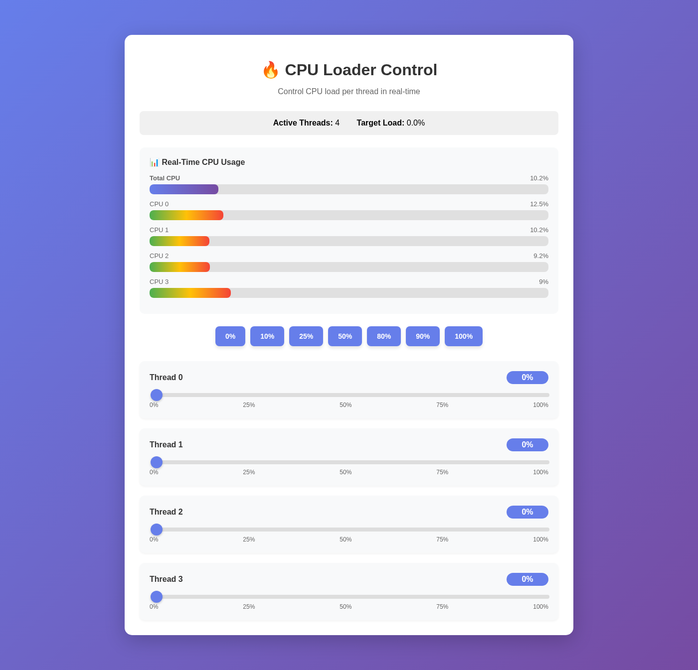
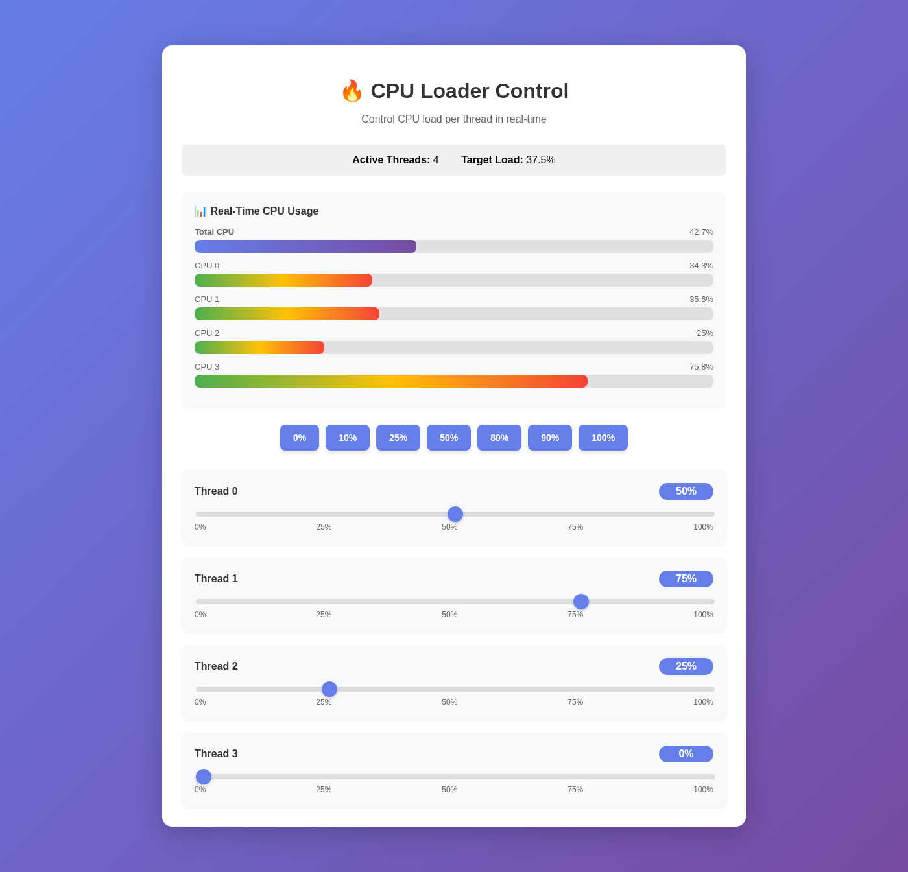
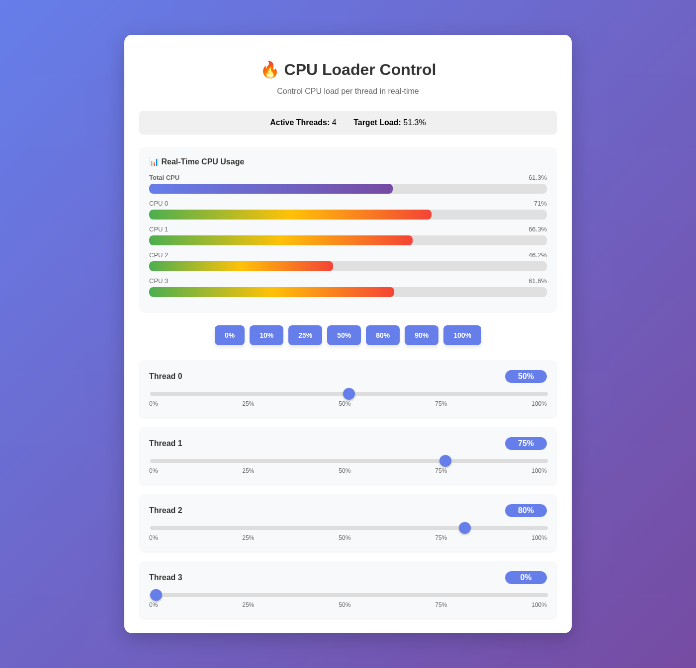
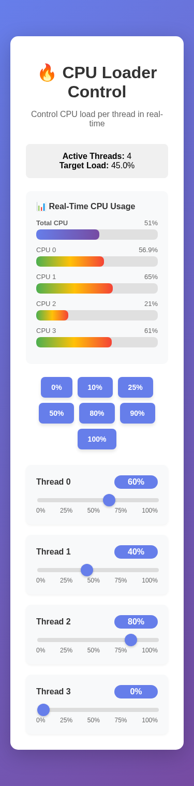

# CPU Loader

[](https://github.com/the78mole/cpu-loader/actions/workflows/ci.yml)
[](https://github.com/the78mole/cpu-loader/actions/workflows/build-wheels.yml)
[](https://pypi.org/project/cpu-loader/)
[](https://github.com/the78mole/cpu-loader/blob/main/LICENSE)

A high-performance CPU load generator with **per-thread control** through an intuitive WebUI and REST API. Built with a native C extension using pthreads for accurate, nanosecond-precision load generation.

## ✨ Key Features

- **🎯 Precise Per-Thread Control**: Set individual CPU load (0-100%) for each core independently
- **⚡ High Performance**: Native C implementation with pthreads ensures accurate load generation
- **📊 Real-Time Monitoring**: Live WebSocket updates showing actual CPU usage via `psutil`
- **🎛️ Interactive WebUI**: Beautiful gradient interface with sliders and visual feedback
- **🚀 REST API**: Complete programmatic control for automation and testing
- **📱 Responsive Design**: Works seamlessly on desktop and mobile devices
- **🔄 Instant Updates**: Changes take effect immediately with sub-second response time

## 🖼️ Screenshots

### Desktop Interface
<table>
  <tr>
    <td width="50%">
      
      <p align="center"><em>Clean interface showing all CPU threads at idle</em></p>
    </td>
    <td width="50%">
      
      <p align="center"><em>Different load levels: 50%, 75%, and 25% on individual threads</em></p>
    </td>
  </tr>
  <tr>
    <td width="50%">
      
      <p align="center"><em>Real-time metrics showing actual CPU usage with color-coded bars</em></p>
    </td>
    <td width="50%">
      
      <p align="center"><em>Fully responsive mobile interface</em></p>
    </td>
  </tr>
</table>

### Features Shown
- **Visual Load Bars**: Green progress bars show target load, blue bars display actual CPU usage
- **Real-Time Updates**: WebSocket connection provides live metrics every second
- **Preset Buttons**: Quick-set options (0%, 25%, 50%, 75%, 100%) for all threads
- **Smooth Gradients**: Modern UI with purple-to-blue gradient design

## Installation

### From Pre-built Wheels (Recommended)

Pre-compiled wheels are available for Linux (x86_64, ARM64) and macOS (x86_64, ARM64):

```bash
pip install cpu-loader
```

### From Source

1. Clone the repository:
```bash
git clone https://github.com/the78mole/cpu-loader.git
cd cpu-loader
```

2. Install dependencies and build C extension:
```bash
uv pip install -e .
```

This will compile the high-performance C extension for efficient CPU load generation.

3. (Optional) Set up pre-commit hooks for development:
```bash
pre-commit install
```

4. (Optional) Set up commit message template for semantic versioning:
```bash
git config commit.template .gitmessage
```

See [COMMIT_MESSAGE_FORMAT.md](COMMIT_MESSAGE_FORMAT.md) for commit message guidelines.

## Usage

### Starting the Server

```bash
uv run src/main.py
```

The server will start on `http://localhost:8000`

### WebUI

Open your browser and navigate to `http://localhost:8000`

**Features:**
- **Individual Thread Control**: Use sliders to set load for each thread (0-100%)
- **Preset Buttons**: Quick-set all threads to 0%, 10%, 25%, 50%, 80%, 90%, or 100%
- **Live Stats**: View active thread count and average load
- **Real-time Updates**: Changes are applied instantly with visual feedback

### REST API

#### Get Thread Status
```bash
curl http://localhost:8000/api/threads
```

Response:
```json
{
  "num_threads": 4,
  "loads": {
    "0": 0.0,
    "1": 0.0,
    "2": 0.0,
    "3": 0.0
  }
}
```

#### Set Load for Specific Thread
```bash
curl -X PUT http://localhost:8000/api/threads/0/load \
  -H "Content-Type: application/json" \
  -d '{"load_percent": 50.0}'
```

#### Set Load for All Threads
```bash
curl -X POST http://localhost:8000/api/threads/load/all \
  -H "Content-Type: application/json" \
  -d '{"load_percent": 75.0}'
```

#### Change Number of Threads
```bash
curl -X POST http://localhost:8000/api/threads \
  -H "Content-Type: application/json" \
  -d '{"num_threads": 8}'
```

## API Documentation

Once the server is running, visit `http://localhost:8000/docs` for interactive API documentation powered by Swagger UI.

## Example Script

An example script (`src/example.py`) is provided to demonstrate programmatic control:

```bash
# Start the server first
uv run src/main.py

# In another terminal, run the example
uv run src/example.py
```

The example demonstrates:
- Getting current status
- Setting all threads to a specific load
- Gradually increasing load
- Individual thread control
- Resetting to idle

## Architecture

- **src/cpu_loader_core.c**: High-performance C implementation using pthreads for CPU load generation
- **src/cpu_loader.py**: Python wrapper providing a clean API to the C extension
- **src/main.py**: FastAPI application with REST API and embedded WebUI
- **Threading Model**: Native pthreads for maximum efficiency and precise timing
- **Load Algorithm**: High-resolution busy-wait loops with nanosecond precision

## Requirements

- Python 3.8+
- FastAPI 0.115.0+
- Uvicorn 0.32.0+
- Pydantic 2.10.0+
- C compiler (gcc or clang) for building the extension

## Use Cases

- **Performance Testing**: Test application behavior under various CPU loads
- **Stress Testing**: Validate system stability under high CPU utilization
- **Thermal Testing**: Check cooling system effectiveness
- **Power Consumption Analysis**: Measure power usage at different load levels
- **Benchmarking**: Create reproducible load scenarios

## Development

### Pre-commit Hooks

This project uses pre-commit hooks to ensure code quality. The hooks include:

- **Code Formatting**: Black and isort for consistent Python formatting
- **Linting**: Flake8 for code quality checks
- **Type Checking**: Mypy for static type analysis
- **General Checks**: Trailing whitespace, end-of-file fixes, YAML/JSON/TOML validation

To run pre-commit manually on all files:
```bash
pre-commit run --all-files
```

The hooks will run automatically on `git commit` after installation.

### Building and Publishing Releases

The project uses **automatic semantic versioning** with GitHub Actions:

#### Versioning Rules

Versions are automatically determined based on commit messages:

- **Patch bump** (0.0.X): Every commit to main
- **Minor bump** (0.X.0): Commits prefixed with `feat:`
  ```bash
  git commit -m "feat: add new CPU monitoring feature"
  ```
- **Major bump** (X.0.0): Commits with `major:`, `breaking:`, or `BREAKING CHANGE:`
  ```bash
  git commit -m "major: redesign API interface"
  git commit -m "breaking: remove deprecated endpoints"
  ```

#### Release Process

1. **Commit and push to main**:
   ```bash
   git add .
   git commit -m "feat: add WebSocket support"
   git push origin main
   ```

2. **Automated workflow**:
   - Version is automatically calculated using semantic versioning
   - Wheels are built for Linux (x86_64, ARM64) and macOS (x86_64, ARM64)
   - Python versions: 3.8, 3.9, 3.10, 3.11, 3.12
   - Source distribution (sdist) is created
   - All artifacts are published to PyPI
   - A GitHub Release is created with version tag and artifacts

## License

MIT License - see [LICENSE](LICENSE) file for details.
